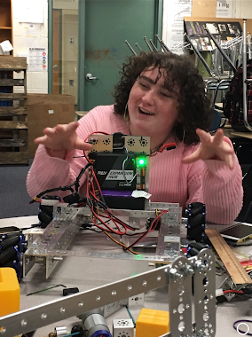

# Team Biographies

#### Josiah Lorenz:

- Age: 17 yrs, Senior
- Interests: cross country, track, pole vaulting, camping, and computers
- Role: Engineer

---

#### Ethan Yost:

- Age: 17 yrs, Senior
- Interests: mechanical engineering, soccer, and track
- Role: Engineer

---

---

#### Reid Sodeman:

- Age: 17 yrs, Senior
- Interests: working and nature
- Role: Engineer, Programmer Mentee

---

#### Mimi Garland

- Age: 18 yrs, Senior
- Interests: art, music, and Dungeons and Dragons
- Role: Support

---

---

#### Emily Eagle Eye

- Age: 18 yrs, Senior
- Interests: art, activism, and community service
- Role: Team Captain, Manager

---

#### Megan Porter

- Age: 17 yrs, Senior
- Interests: soccer, basketball, and animal sciences
- Role: Outreach and Spirit Captain

---

---

#### Shark Zhao

- Age: 15 yrs, Sophomore
- Interests: plants and sports
- Role: Programming Mentee, Support

---

#### Clyde Oglesby

- Age: 15 yrs, Sophomore
- Interests: karate and volunteering
- Role: Programming Mentee, Support

---

---

#### Carson Turnbo

- Age: 17 yrs, Senior
- Interests: Dungeons and Dragons, Magic the Gathering, and music
- Role: Programmer, Engineer

---

#### Jarrett Garner

- Age: 18 yrs, Senior
- Interests: Dungeons and Dragons, Magic the Gathering, and drawing
- Role: Support, Technical Artist

---

---

#### Rebecca Lorenz

- Age: 52, Substitute Teacher
- Interests: traveling, family, and camping
- Role: Coach

---

#### Jericho Dunn

- Age: ??, English Teacher
- Interests: sports and connecting with students
- Role: Coach

---

---

#### Erich Scheid

- Age: 18, Freshman at University of Oregon
- Interests: programming and piano
- Role: Programming Mentor

# Meeting Notes

### Sep 7

__Goals__

- Watch the 2019 FTC video
- Meet other teams
- brainstorm strategy

__Summary__

For our first meeting, we drove to Springfield to watch the launch videos with other teams. We participated in several discussion tables with other teams on topics including the autonomous period, notebook strategies, and gameplay. We also participated in a Kahoot game about FIRST, and a raffle give away, where we won a bag of tank treads, some motors, and a pair of Mecanum wheels.

    
    

        Description.
    

    
    
    

        Carson loot. ^
    

    
    
    
    

        Can't figure out how to elegantly describe a group of images.
    

    
    
    
    
    
    

---

### Sep 12

__Goals__

- Establish roles
- Discuss potential sponsors

__Summary__

For our first meeting back in the robotics room, we spent a majority of the time assigning roles for the team, and brainstorming some preliminary design ideas. As a team made up entirely of seniors, we were worried about making sure the program continued after graduation, so we looked into applying for sponsorship, and discussed recruitment strategies. Ethan took control of running the meeting to assign roles, and Emily talked about what details she hoped would be included in the notebook this year.

    
    
    
    
    
    

---

### Sep 18

__Goals__

- Dismantle last year's robot
- Introduce new members (yay)

__Summary__

A majority of the team, including our coach, Rebecca Lorenz, were going on a field trip to a Portland Timbers soccer game, so we met in the robotics room to work for a just a little bit before we had to leave. We worked on dismantling the old robot. We had two sophomores visit the robotics room, both of whom agreed to join the team.

__Coding__

The new members, Shark Zhao and Clyde Oglesby, committed to being programmers based upon a prior experience learning Java.

---

### Sep 26

__Goals__

- Organize the room
- Create a calendar
- Plan the budget

__Summary__

Today, we worked on our budget and fundraising strategy, a team calendar, and addressing the mess of a robotics room. For the budget, we wrote down a list of possible sponsors we wanted to contact and other fundraising opportunities.

---

### Oct 2

__Goals__

- Unpack boxes
- Get acquainted with robotics again

__Summary__

We successfully unpacked the packages we received from Andymark, containing some critical replacement parts we needed. No one was hurt in the unpackaging process.

__Coding__

Mentor Erich explained the workflow we use to Shark and Clyde. This included how to use Android Studio and Git, as well as basic programming concepts frequently used here, such as DRY and FTC-specific modules.

---

### Oct 6

__Coding__

Coders had a brief discussion entertaining the idea using text-to-speech in the programming. Conclusion was that, while it would be feasible, it would also be pointless.

---

### Oct 7

__Coding__

Another discussion among the programmers, this one involving the discontinuation of the use of the Git GUI Client "Git-Fork". Version control would consist of the Git cli from that day forward.

---

### Oct 8

__Goals__

- Build the robot's drivetrain
- Organize small parts

__Summary__

Today was the first practice with all the parts necessary to begin building the robot. Joey Madison, former yearbook student came by to visit. We decided on a rectangular base using Andymark parts, along with four Mecanum wheels. The motors are attached inside u channels on the sides of the bot attached to gears that control the wheels. We opted for Mecanum wheels because it allowed us to move in any direction, from a stationary position. Super useful in autonomous.

---

### Oct 9

__Goals__

- Work on driver control code
- Brainstorm stone manipulation

__Summary__

We worked on several ideas for picking up stones and placing them on the platform. We decided on making some kind of hand that would grasp the blocks to carry them. We considered using hot glue of surgical tubing to make it easier to grip them. We also continued to work on the drivetrain and chassis. Several members of the boys soccer team came in to check things out before a game.

---

### Oct 11

__Coding__

The coding team used this time to work more. Carson and Mentor Erich expanded Shark and Clyde's knowledge of the code base. The whole programming group worked on changing up the code to work for this new challenge.

---

### Oct 15

__Goals__

- Decide on a lift system

__Summary__

For our system of stacking the stones, we decided to make a scissor lift out of u channels, with a claw affixed to the top to grab stones. It would be a vertical scissor lift consisting of three layers with the hand attached to the top layer.

---

### Oct 16

__Goals__

- Attach scissor lift
- Complete autonomous
- Prepare for League Meet One

__Summary__

Today was our last full day to work on the robot before League Meet One, which meant it was very important to attach the scissor lift to the body of the robot. Reason being, the drive team wouldn't have any practice before the competition. We attached it to u channels mounted above the main body. For the drivers, one person would control both the scissor lift and claw, while the other controls the drive train.

### Oct 17

__Goals__

- Pack up and go to League Meet Zero

__Summary__

We had a little while before the meet so we decided to take off the scissor lift and add in a panel beneath it for stability. Then we packed all of our stuff up and drove out to Junction City High School for the meet. We played five matches. We left undefeated, and for the majority of the time all the code and mechanisms functioned as intended. Inevitably, towards the end of the day, gears began to strip and a screws loosened. We still pulled through though, as the downward trend was seen in the other teams as well.

__Coding__

Our coding team used time during school and right before leaving to the meet to finish up some last minute coding. And, of course, adjusted many variables throughout the event.

---

### Oct 23

__Coding__

Discussed possibility of using Python instead of Java.

---

### Oct 25

__Coding__

Mentor Erich helped Shark and Clyde program autonomous.

---

### Nov 1

__Goals__

- Debrief of League Meet Zero
- Repair robot

__Summary__

After our stellar performance at League Meet Zero, our robot needed some serious repair. The gear for the scissor lift had stripped, making it unable to extend upwards. Since we planned to make significant changes to the bot anyway, we decided it was best to separate it from the chassis so they could be worked on individually.

---

### Nov 4

__Goals__

- Build practice arena

__Summary__

We recently received the mats we ordered for the practice arena, so began its construction. Ethan brought in some plywood and pvc pipe to construct the arena elements we didn't have. We ordered the foundation element from Andymark as well. We decided to put the arena in the corner, so that we would only have to build two walls. We used the pvc pipe to set up the bars that go across the center of the playing field. After Ethan and Mimi set up the arena, we worked on the stone manipulation mechanism.

---

### Nov 5

__Goals__

- Reattach revamped scissor lift
- Work on stone manipulation mechanism

__Summary__

We reattached the scissor lift to the chassis of the bot, after fixing and improving both the drive train and the lift. Megan’s little sister came to visit before her wrestling practice. The coders started working on a skystone detection system.

---

### Nov 6

__Goals__

- Work on cable management
- Work on system to move foundation element

__Summary__

Today was a short practice to work on the system for moving the foundation element. We decided on two arms rotated around an axis by a servo. The coders worked on attaching the webcam and using it to detect the skystones.

---

### Nov 7

__Coding__

Today Mentor Erich helped Carson optimize the code. Meanwhile, Shark came up with the idea to use time for autonomous, which was instantly shot down.

---

### Nov 8

__Goals__

- Test reliability of drivetrain and scissor lift
- Practice driving
- Pack up for League Meet One
- Finish autonomous and driver controlled code

__Summary__

This was our last practice before League Meet One. They were held on the same day, consecutively. This meant we had to be competition ready. We finished up the scissor lift and the drivetrain. We also practiced driver controlled period, and tested and tightened up our autonomous. The coders worked on using the webcam or the phone camera to detect the skystone during autonomous. Once we were done we packed up all of our stuff, including the robot. The Lorenz’ were in charge of bringing everything to the meet.

---

### Nov 9

__Goals__

- See if drive train and scissor lift can survive five matches

__Summary__

For League Meet One we had to be at junction city high school at 8:30 in the morning. We played a total of 5 matches. We tried several different drive team configurations. Our drivetrain held up throughout the meet, but our scissor lift had some problems. Yet again, we left undefeated.

__Coding__

Autonomous included the ability to move the foundation element. Other programs were in the works, but not ready for application yet.

---

### Nov 14

__Goals__

- Debrief of League Meet One

__Summary__

We debriefed about what went well and what didn’t go as well at League Meet One. And detached the scissor lift from the main chassis of the robot, so that they could be worked on separately. We unpacked from the league meet, and built a throne out of the blocks in the arena.

---

### Dec 2

__Goals__

- Work on scissor lift

__Summary__

Reid built a catapult out of extra parts, rubber bands, and our scoop from last year. Goals were not achieved today.

---

### Dec 9

__Goals__

- Work on skystone detection

__Summary__

The coders worked on using the webcam mounted beneath the chassis of the robot to detect the skystones during autonomous.

__Coding__

The coders did extensive testing on skystone detection. We encountered great strife in trying to get all the third-party "DogeCV" library to function.

---

### Dec 10

__Goals__

- Cut and attach fiberglass sides
- Continue work on autonomous 

__Summary__

Ethan brought in a piece of fiberglass to use as sides for the robot. We measured and cut pieces big enough to cover the sides, with space for the wheels. We then attached them using a piece of u channel that we then attached to the chassis of the robot. We intend to put vinyl number stickers on the fiberglass. Mr. Edmundson, our art and yearbook teacher, came in to take pictures of the robotics club for the yearbook.

---

### Dec 12

__Goals__

- Get robot competition ready
- Polish autonomous

__Summary__

With only two days until League Meet Two/Three, we needed to be ready to compete so that our drivers would have some time to practice the driver controlled portion. We tried to finish up the autonomous code today, but we were still having trouble with the webcam. We also had some of the varsity boys basketball team come in and check out the bot. As well as our district TAG coordinator, Angie Pebworth, along with her two sons and one of their friends. We showed them around the room, let a couple of the boys drive the robot, and showed the kids how the catapult Reid built works.

---

### Dec 13

__Goals__

- Pack up for League Meet Two/Three
- Practice driving
- Fix webcam issues

__Summary__

This was our last practice before League Meet Two/Three, so we had a lot of preparation to do. We packed up all of our tools and extra parts to take to Thurston High School. Our builders were mostly done working on the robot, so we practiced driving and coaching. The coders continued trying to solve the issues detecting the skystones, and determined it was too sensitive to the lighting and shadows.

---

### Dec 14

__Goals__

- Survive League Meet Two/Three

__Summary__

In League Meet Two/Three, we won 3 out of 5 of our matches in both meets, also placing 4th in both. Our drive train held up for the entire tournament, but the linear slide stripped completely. We were able to complete all of our matches.

---

### Dec 17

__Goals__

- Unpack after meet
- Detach scissor lift from chassis

__Summary__

We had a short meeting to unpack after the meet and prepare the robot for improvements.

---

### Dec 19

__Goals__

- Debrief after League Meet Two/Three
- Work on drivetrain
- Work on code

__Summary__

We had a meeting to discuss what went well, what didn't go so well, and what we needed to do before the next competition. The first thing we talked about was finding a better way to coordinate the team, and to have a designated team captain. The following is a record of the notes Emily used to run the meeting.

1. Driving
   - Assign A Team and B Team
   - How do we better support our driving teams
2. Team management
   - Is everyone okay with me taking a leadership role?
   - How can I best support you?
   - Do we want separate coding, building, and driving practices?
   - Practice schedule
   - What is the best way to organize the team?
   - How do we keep morale up?
3. Budget
   - What do we need?
   - Can we afford it?
   - How do we raise the money?
4. Competition planning
   - How should we make time for driving practice?
   - Who should be coaching?
   - What does the coach need to be doing?
   - Gracious professionalism and making connections with other teams

We started by confirming if it was okay for Emily to take on the leadership role. We decided Ethan and Josiah would be our main drivers, with Jarrett and Shark as our back up team. We have yet to decide on a drive coach and human player. We planned to practice on Tuesdays and Thursdays, adding additional practices as needed and having team meetings on Tuesdays. We also made a plan to have Mimi and Clyde prioritize our sponsor letter. After the meeting we worked on the drive train and autonomous. Mr. Best, our math teacher, came by to check out the robot and challenge details for this year.

---

### Jan 4

__Goals__

- Keep up the momentum after winter break
- Start working on improving the main linear slide

__Summary__

Ethan and Josiah met in the robotics room on the last Saturday of winter break so that they could work on improving the linear slide we use for raising the scissor lift. We originally had a simple plastic rack and pinion linear slide, which was unreliable, so we decided to change to a sturdier screw drive. As a side note, Megan placed second in her weight class at the wrestling tournament being held at the school.

---

### Jan 9

__Goals__

- Reattach scissor lift to chassis

__Summary__

This was our first full meeting after winter break, so we had a meeting to restate what everyone needs to be working on and how we will reach our goals of having a functioning robot by competition time. We added some aluminum bars to the underside of the robot to keep it stable, worked on stabilizing the scissor lift and making our claw more reliable.

---

### Jan 10

__Goals__

- Fully attach scissor lift to chassis
- Have driver practice
- Wire management

__Summary__

We met to reattach the scissor lift to the chassis of the robot. We practiced driving with Josiah controlling the drive train and Ethan controlling the scissor lift and linear slide.

---

### Jan 13

__Goals__

- Drive practice
- Extend the reach of the scissor lift

__Summary__

Since our claw and scissor lift have been working reliably, we decided to add another layer to the scissor lift. Now that we have four layers of u channel, without a time limit, we can stack up to seven blocks. Within the time we can stack around four. Mr. Edmundson checked-in again.

---

### Jan 14

__Goals__

- Cable management
- Rehearse interview

__Summary__

We worked on driving and making sure of the reliability of all of our components. We practiced stacking blocks with the robot, and made some cool block sculptures with our hands.

---

### Jan 15 

__Coding__

Mentor Erich taught Clyde Markdown as a better way of taking notes.

---

### Jan 16

__Goals__

- Polish autonomous programs

__Summary__

We did some cable management, and a few tweaks to the drivetrain and scissor lift. Mr. Burgess, our history teacher, came by to see the robot. Emily began polishing and printing the notebook.